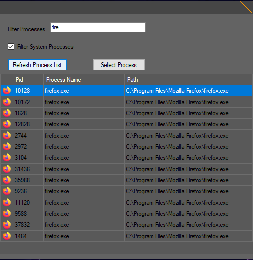
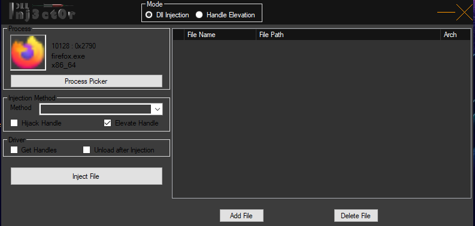

# Injector

<table>
  <tr>
    <td>Process Picker UI</td>
     <td>Library Injection UI</td>
     <td>Handle Elevation UI</td>
  </tr>
  <tr>
    <td valign="top"></td>
    <td valign="top"></td>
    <td valign="top"></td>
  </tr>
 </table>
 

Security tool for injecting libraries into executables and elevating processe handles

## Usage
#### Handle Elevation
* Select Process picker
  * On form that pops up select target process 
  You can use a filter to filter the process list
* **To Obtain all available permissions**
  * Do not change the N_Access field.. Keep it as it is 
  
* **To change current access permission to another desired permission [bugged]**
  * Change the N_Access field of the handle to the desired permission

* **Make sure the check box at the beginning of the handle entry is checked for both cases**
* Click the Elevate Handle button  

User confirmation if process has been elevated has not yet been implemented but can be verified using tools such as sysinternals process explorer

## Important Information
* Handle elevation is implemented but has only been tested on windows 1903
  * It may or may not work on other versions
  * Work is in progress to include support for other windows versions
* Work is also currently in progress to include library injection

## warnings
* Care has been taken to avoid BSOD's but still may occur especially when elevating handles

